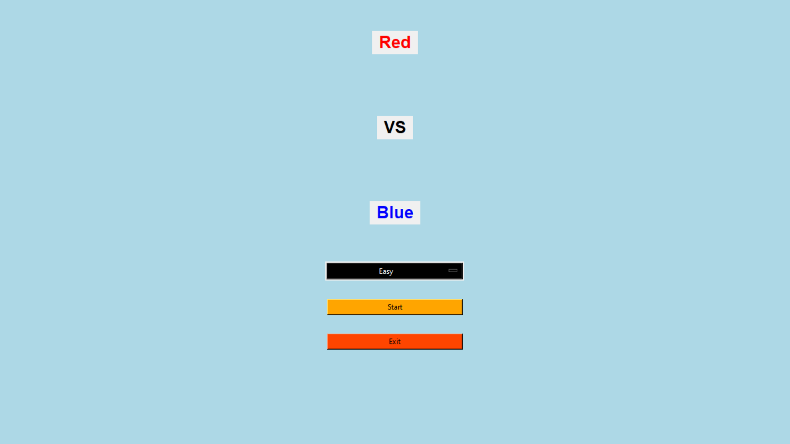

# 🔴🟦 Red vs Blue — Box Drawing Game

A nostalgic remake of the **classic box-drawing game** we used to play as kids — now in Python with a digital twist!

As a child, I loved the game where we connected dots to create boxes. This project recreates that experience with a modern UI using **Tkinter**.

---

## 🎮 Gameplay Overview

- Select a difficulty level: **Easy (3x3)**, **Medium (4x4)**, **Hard (5x5)**
- Two-player mode: **Red** vs **Blue**
- Click between dots to draw lines
- Complete a box to earn a point and an extra turn
- Player with the most boxes wins!

---

## 📸 Screenshots

> 🖼️ Add your screenshots in the `images/` folder and update the links below

### 🎯 Game Menu  

### 🔴🟦 In-Game UI  

---

## 🔧 Tech Stack

- **Python 3**
- **Tkinter**

---

## 🗂️ Project Structure

